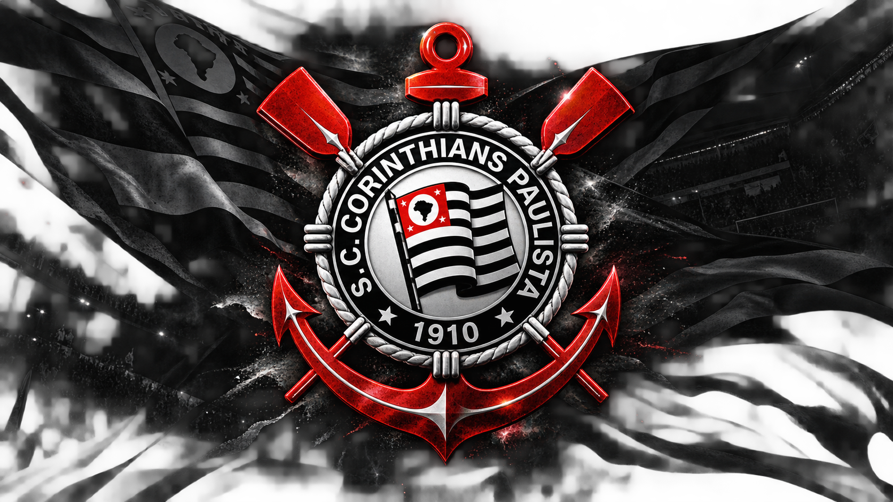

  

  

<h1 align="center">👋 Olá! Eu sou Guilherme Bessa</h1>

  

Sou estudante de **Desenvolvimento de Sistemas** e estou construindo minha base na área de tecnologia, estudando lógica, programação e boas práticas de desenvolvimento.

Meu foco é aprender de forma consistente, praticar com projetos e transformar o conhecimento em soluções reais.

Estou em constante evolução e busco novas oportunidades para crescer como desenvolvedor.

 

<h3 align="center">🎓 Formação</h3>

**Cursando Desenvolvimento de Sistemas**

`ETEC HORÁCIO AUGUSTO DA SILVEIRA`

`SÃO PAULO`

  

<h1 align="center">🚀 O que estou aprendendo</h1>

  As tecnologias que fazem parte da minha formação e da minha rotina de estudos.

<h3 align="center">Front-End</h3>

  
  
  
  
  
  

<h3 align="center">Back-End / Programação</h3>

  
  

<h3 align="center">Ferramentas e Tecnologias</h3>

  
  
  

  

  

  

<h1 align="center">🌐 Minhas Redes Sociais</h1>

  Me segue lá para qualquer dúvida

  
  
  

 

  

  <code>&lt;/&gt;</code>

  <code>while (estudando) { praticar(); construir(); evoluir(); }</code>

  <i>Cada linha de código é um passo, cada projeto é uma prova de evolução.</i>

  © 2026 Guilherme Bessa · Desenvolvimento de Sistemas

  

